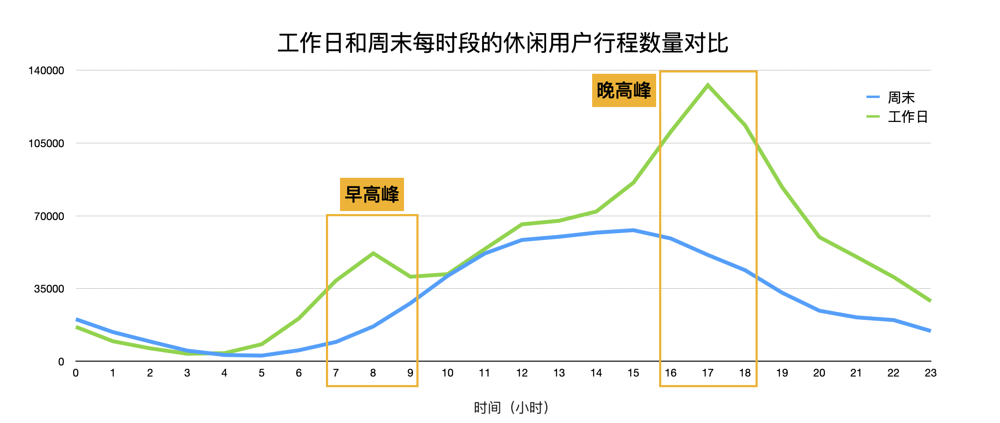
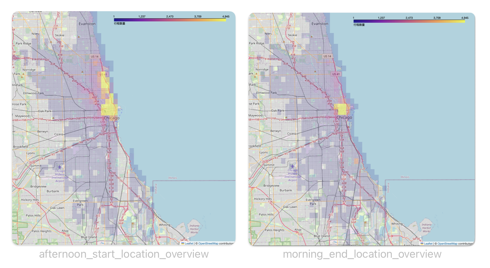
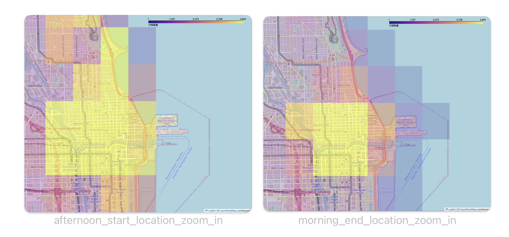
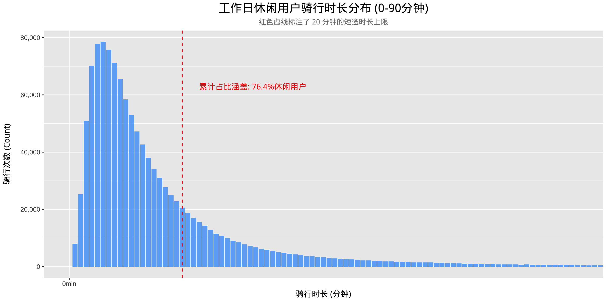

## 1.项目标题与简介 (Project Title & Intro)
芝加哥共享单车短途通勤行为分析


## 2.数据来源 (Data Source)
#### 数据获取链接: 
Coursera Data Portal: https://divvy-tripdata.s3.amazonaws.com/index.html）
#### 数据时间跨度:
2024年12月1日 至 2025年11月30日

## 3.环境配置 (Environment Setup)
#### 使用的工具：
BigQuery (SQL), R (ggplot2, geohashTools), Python(pandas, folium)

#### 如何克隆仓库及安装依赖:
**1. 克隆仓库：** <br>
打开终端（Terminal），运行以下命令将本项目下载到本地：
git clone https://github.com
cd bike_share_analysis

**2. R：** <br>
本项目的数据分析与可视化部分基于 R 版本2026.01.1+403 请在 R 控制台中运行以下脚本安装所需的软件包：

**核心数据处理与绘图:**
install.packages(c("tidyverse", "lubridate", "ggplot2", "dplyr", "scales"))

**地理空间分析工具:**
install.packages("geohashTools")

**3. Python：** <br>
本项目的数据可视化部分基于 Python 版本 3.13 控制台中运行以下脚本安装所需的软件包：
import pandas as pd
import folium
from branca.colormap import LinearColormap

## 4.工程结构 (Folder Structure) 
```
bike_share_analysis/
├── data/                                                   # 禁止推送到云端的目录
│   ├── raw/                                                # 原始数据 (1.2GB CSV 文件集)
│   └── processed/                                          # 清洗后的中间表/产出结果
│       ├── 01_clean_trip_data.csv 
│       └── 02_casual_user_weekday.csv 
├── scripts/                                                # 核心脚本目录
│   ├── 01_data_cleaning.sql
│   ├── 02_eda_queries.sql
│   ├── 03_target_audience_extraction.sql
│   ├── 04_commute_geo_jaccard_comparison.R
│   ├── 05_commute_length_distribution.R
│   └── 06_commute_geo_grid_map.ipynb
├── docs/                                                   # 文档与元数据
│   └── data_dictionary.md
├── visuals/                                                # 图表输出目录
│   ├── line_ride_count_comparison_weekday_weekend.png
│   ├── histogram_weekday_ride_length_distribution.png
│   └── grid_map_casual_commute/
│       ├── morning_end_location.html
│       ├── afternoon_start_location.html
│       ├── comparison_overview.png
│       └── comparison_zoom_in.png
├── README.md                                               # 项目工程说明书
└── .gitignore                                              # 核心安全阀：版本控制豁免名单
```


## 5.数据处理流程 (Pipeline)
Step 1: BigQuery 清洗（排除无效行程、计算时长）
Step 2: 地理空间网格化 (Geohashing)
Step 3: 探索性数据分析 (EDA)
Step 4: 绘制可视化图表（R, Python）


## 6.核心发现 (Key Findings)

休闲用户在工作日高峰期展现出强烈的通勤特征。<br>
时间：


<br>

空间：




<br>
<br>

通勤的休闲用户单次骑行时长高度集中在20分钟以内。



## 7.注意事项 (Notes)
#### 数据脱敏说明：

##### Ignore data files
data/
*.csv
*.xlsx

##### Ignore OS generated files
.DS_Store

##### Ignore credentials
.env


#### 已知的限制
21% “start_station_name” 数据因电单车的“无桩停放”业务性质导致缺失。后续分析热门停车站点时会避免分析车站名称权重方向，转而以经纬度坐标替代物理站点名称进行区域聚合。